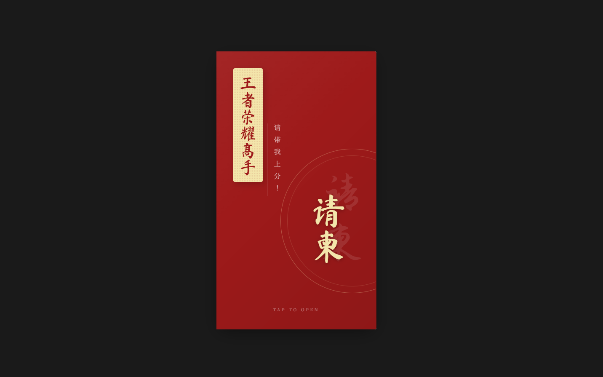

# honor-of-kings-invitation

预览链接：[上分之约·至臻邀请](https://aicoding.juejin.cn/pens/7606373154298003466)

## 效果展示

封面：



内容：


---

## 部署

本项目可通过MCP部署到掘金并生成预览链接

在 Cursor 中对 AI 说一句即可触发部署，例如：

- 「把 invitation 部署到掘金」
- 「帮我部署 @invitation 到掘金」

或在使用 MCP 的客户端里直接调用工具 **deploy_frontend**，参数：

| 参数 | 说明 |
|------|------|
| `projectDir` | `invitation` 目录的**绝对路径**，例如：`d:\My_Projects\honor-of-kings-invitation\invitation` |

**前置条件：** 已安装并配置掘金 MCP，且 `JUEJIN_TOKEN` 有效。

#### MCP 配置示例

在 Cursor 的 MCP 配置（如 `~/.cursor/mcp.json` 或设置中的 MCP）中加入：

```json
{
  "mcpServers": {
    "juejin-deploy-mcp": {
      "command": "npx",
      "args": [
        "--registry=https://registry.npmjs.org",
        "-y",
        "@juejin-team/mcp-server@latest"
      ],
      "env": {
        "JUEJIN_TOKEN": "你的 token"
      }
    }
  }
}
```

将 "你的 token" 替换为你在掘金获取的真实 Token，保存后重启 Cursor。
