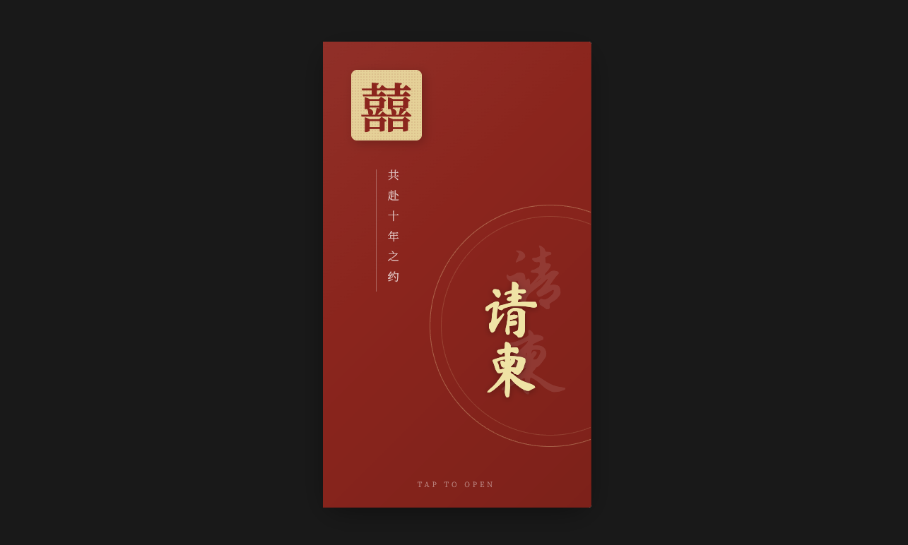

# honor-of-kings-invitation

预览链接：[上分之约·至臻邀请](https://aicoding.juejin.cn/pens/7607071095419289650)

## 效果展示




---

## 部署

本项目可通过掘金 MCP 部署至 [掘金 Coding](https://aicoding.juejin.cn/)，便于国内用户在线预览。

步骤：
1. 通过这个链接获取你账号的token: aicoding.juejin.cn/tokens
2. 在 Cursor 或 Trae 等支持 MCP 的 IDE 中，配置掘金的 Coding 页面发布的 MCP，把刚才获取到的 token 配置到MCP 中。

    如在 Cursor 的 MCP 配置（如 `~/.cursor/mcp.json` 或设置中的 MCP）中加入：

    ```json
    {
      "mcpServers": {
        "juejin-deploy-mcp": {
          "command": "npx",
          "args": [
            "--registry=https://registry.npmjs.org",
            "-y",
            "@juejin-team/mcp-server@latest"
          ],
          "env": {
            "JUEJIN_TOKEN": "你的 token"
          }
        }
      }
    }
    ```
    保存后重启 Cursor

3. 在 Cursor 中对 AI 说一句即可触发部署，例如：
    - 「把 /invitation 部署到掘金」
    - 「帮我部署 @invitation 到掘金」

